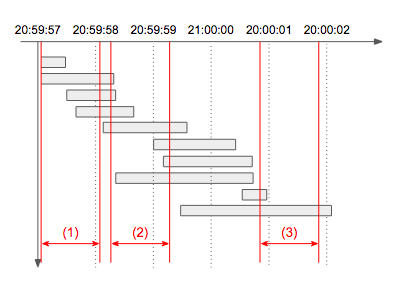

# 2018 KAKAO BLIND RECRUITMENT | [1차]추석 트래픽 풀이

## 문제

[2018 KAKAO BLIND RECRUITMENT > [1차] 추석 트래픽
](https://programmers.co.kr/learn/courses/30/lessons/17676)

## 해설

이번 문제는 탐욕법 ( Greedy ) 알고리즘을 알고있는지를 묻는 문제였습니다.

### 탐욕법 ( Greedy ) 알고리즘 일까요?

이 문제는 탐욕법 중에서도 전형적인 "활동 선택 문제"에 포함된다고, 볼수있습니다.
"활동 선택 문제"의 특징은 시작시간과 끝시간이 있는 활동들의 리스트와 이 활동을 진행할수 있는 공간이 있습니다. 그리고 특정시간에 가장 많은 활동을 할수 있는 경우를 고르는 것입니다.

가장 대표적인 활동 선택 문제로는 boj에 있는 [회의실](https://www.acmicpc.net/problem/1931) 문제가 있습니다.

현재 문제에서는 트래픽은 활동에 해당하고, 처리하는 서버는 활동을 진행할수 있는 공간입니다.

문제에서 친절하게 회의실 문제를 설명할때, 가장 많이 사용하는 시간-활동 그래프까지 주어졌습니다.



추가적으로, 활동 선택 문제는 끝시간으로 정렬해서 푸는 문제입니다. 그런데 여기서 미리 끝나는 시간을 기준으로 정렬된 리스트를 주었습니다.

이를 토대로 해당문제를 탐욕법 그중에서도 "활동 선택 문제"임을 알 수 있었습니다.

## 입력

이 문제는 다른 문제들과 다르게 주어진 입력이 문자열 하나로 이루어져 있습니다.
그리고 문자열 안에 끝 시간과 진행시간이 들어있고, 일반적으로 문제의 편리함을 위해 시간을 int형태로 주었던 다른 문제들과 달리 실무에서 자주 쓰이는 시간 포멧 "YYYY-MM-DD hh:mm:ss.sss"로 주었졌습니다.

까다로운 입력이지만, 하나씩 풀어 우리가 풀기 편한 형태로 바꾸어 줍시다.
먼저, 활동을 담당할 class를 정의해줍니다. 이를 Task라고 합시다.
포멧팅된 시간타입을 받기위해 Timestamp를 이용하였습니다.

```java
public class Task{
  Timestamp start;
  Timestamp end;

  public Task(Timestamp start, Timestamp end) {
    this.start = start;
    this.end = end;
   }
}
```

먼저 Task를 담을 리스트 logs를 정의합니다.
그리고 한줄씩 라인을 받으면서 먼저 공백(" ")으로 분리한후, 끝시간과 처리시간을 분리하여 시작시간을 구한뒤 각 Task를 리스트로 저장합니다.

```java
List<Task> logs = new ArrayList<>();

  private void initialLogs( String[] lines ) {
    for (String line : lines) {
      String[] query = line.split(" ");

      String strEnd = query[0] + " " + query[1];
      String strDuration = query[2];

      Timestamp end = Timestamp.valueOf(strEnd);

      strDuration = strDuration.substring(0, strDuration.length() - 1);
      long duration = (new Double(Double.parseDouble(strDuration) * 1000 - 1)).longValue();
      // System.out.println(duration);
      Timestamp start = new Timestamp(end.getTime() - duration);

      logs.add(new Task(start, end));
    }
  }
```

## 풀이

입력까지 받아졌다면, 문제는 거의 해결되었습니다.
전형적인 탐욕법의 풀이대로 끝시간에 집중합니다.
루프를 돌면서 현재 Task의 끝나는 시간과 그 뒤에 있는 Task중 (시작시간 - 1초) 가 더 빠른 Task의 숫자를 알면 가장 많이 처리하는 구간의 Task의 수를 구할 수 있습니다.

비교연산을 할때는 Timestamp의 getTime을 메소드를 이용하여 밀리초로 일괄 변경하여 계산합니다.

```java
    for (int i = 0; i < logs.size(); i++) {
      int numTask = 1;
      Task logi = logs.get(i);

      for (int j = i + 1; j < logs.size(); j++) {
        Task logj = logs.get(j);
        if (logi.end.getTime() > logj.start.getTime() - 1000) {
          numTask++;
        }
      }
      answer = Math.max(answer, numTask);
    }
```

## 전체 코드

```java
import java.sql.Timestamp;
import java.util.ArrayList;
import java.util.Collections;
import java.util.Comparator;
import java.util.List;

public class Solution {

  List<Task> logs = new ArrayList<>();

  public class Task {
    Timestamp start;
    Timestamp end;

    public Task(Timestamp start, Timestamp end) {
      this.start = start;
      this.end = end;
    }
  }

  private void initialLogs( String[] lines ) {
    for (String line : lines) {
      String[] query = line.split(" ");

      String strEnd = query[0] + " " + query[1];
      String strDuration = query[2];

      Timestamp end = Timestamp.valueOf(strEnd);

      strDuration = strDuration.substring(0, strDuration.length() - 1);
      long duration = (new Double(Double.parseDouble(strDuration) * 1000 - 1)).longValue();
      // System.out.println(duration);
      Timestamp start = new Timestamp(end.getTime() - duration);

      logs.add(new Task(start, end));
    }
  }

  private void sort() {
    Collections.sort(logs, new Comparator<Task>() {
      public int compare(Task t1, Task t2) {
        Long t1End = t1.end.getTime();
        Long t2End = t2.end.getTime();

        Long t1Start = t1.start.getTime();
        Long t2Start = t2.start.getTime();

        if (t1End == t2End) {
          return t1Start.compareTo(t2Start);
        }

        return t1End.compareTo(t2End);
      }
    });
  }

  public int solution(String[] lines) {
    int answer = 0;
    initialLogs(lines);

    // sort();

    for (int i = 0; i < logs.size(); i++) {
      int numTask = 1;
      Task logi = logs.get(i);

      for (int j = i + 1; j < logs.size(); j++) {
        Task logj = logs.get(j);
        if (logi.end.getTime() > logj.start.getTime() - 1000) {
          numTask++;
        }
      }
      answer = Math.max(answer, numTask);
    }

    return answer;
  }
}
```
